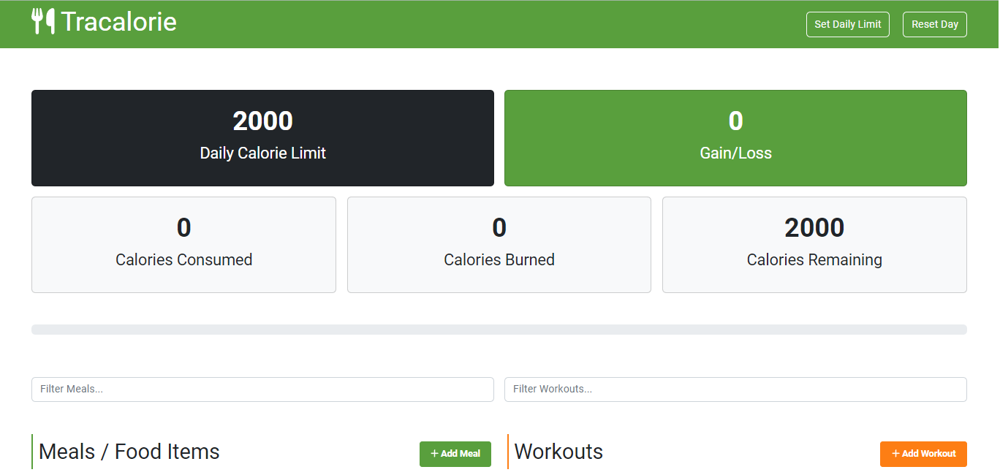

# Tracalorie


This is the Webpack version of the Tracalorie app using OOP's concepts.

![OOP]{project_diagram.png}

## Usage

Install dependencies

```
npm install
```

Run the dev server

```
npm run dev
```

It will start on `http://localhost:3000`

To build for production

```
npm run build
```

Your production files will be in the `dist` folder.

You can view the hosted version of this app at https://spectacular-souffle-a6e5f4.netlify.app
